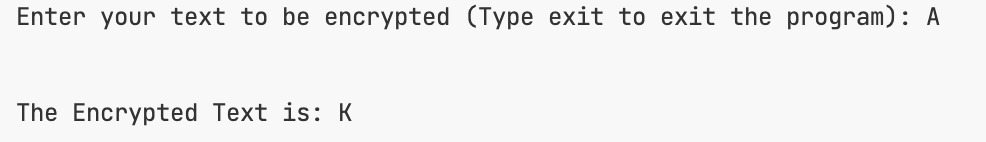
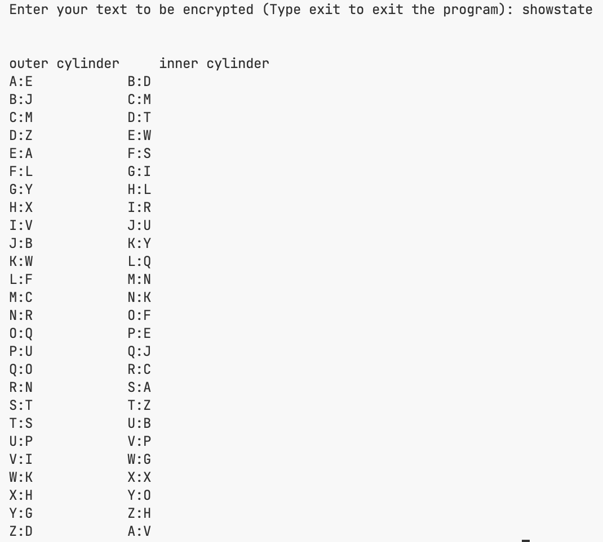
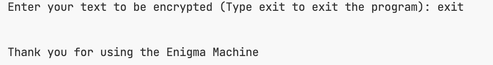

# Rotor Machine Cipher Implementation

## How to Run Docker

To run a Dockerfile, you need to follow a series of steps that involve building a Docker image from the Dockerfile and then running a container based on that image. Here’s a step-by-step guide:

### Step 1: Install Docker

Make sure you have Docker installed on your machine. You can download and install Docker from the [official Docker website](https://www.docker.com/get-started).

### Step 2: Create Your Dockerfile

Ensure you have your `Dockerfile` ready in your project directory. For example, if your `Dockerfile` is named `Dockerfile` and is located in the directory `nyit/crypto/enigma-machine/`, navigate to that directory in your terminal.

### Step 3: Build the Docker Image

Open your terminal and navigate to the directory containing your `Dockerfile`. Use the following command to build the Docker image:

```bash
docker build -t enigma-machine .
```

- The `.` at the end specifies the current directory as the build context.

### Step 4: Run the Docker Container

After the image is built successfully, you can run a container from that image using the following command:

```bash
docker run --rm -it enigma-machine /bin/bash
```

By following these steps, you should be able to successfully run your Dockerfile and execute your command-line tool within a Docker container.

---

## How to run the code

### Encryption

- To encrypt a text, simply type the text into the prompt and hit Enter

#### Example:



### Print the cylinder's state

- To check the cylinder's state, type "showstate" into the prompt and hit Enter

#### Example:



### Exit the program

- To exit the program, type "exit" into the prompt and hit enter.

#### Example:


